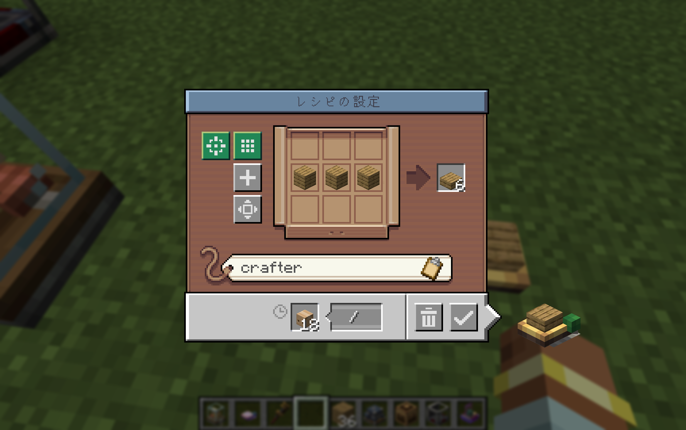
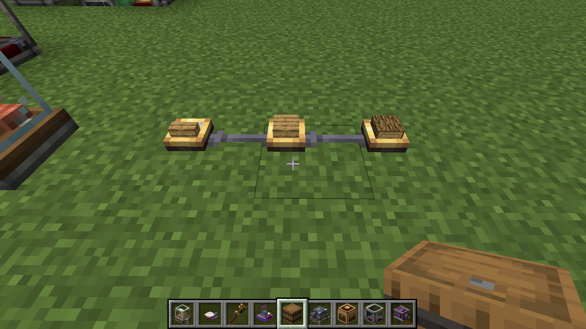

# Create: On Demand Crafting

> [!NOTE]
> 本ModはAIを使用して作成しました。

Create Mod単体では「指定アイテムを常に指定数まで自動作り置きする」動作になります。
これ加えて，「**物流ネットワークから要求があった際のみ，必要な分だけオンデマンドでクラフトする**」動作も実現可能になります。

## 使い方

ファクトリーゲージに追加されているボタンを押してオンデマンドクラフトを有効化します。

## 対応環境

- Minecraft 1.21.1 NeoForgeに対応
- 依存Mod
  - Create 6.0.10

## 既知の問題

画像のように，オンデマンドクラフトを有効化したファクトリーゲージを連続して接続すると，
中間のファクトリーゲージのオンデマンドクラフトが正常に行われません。